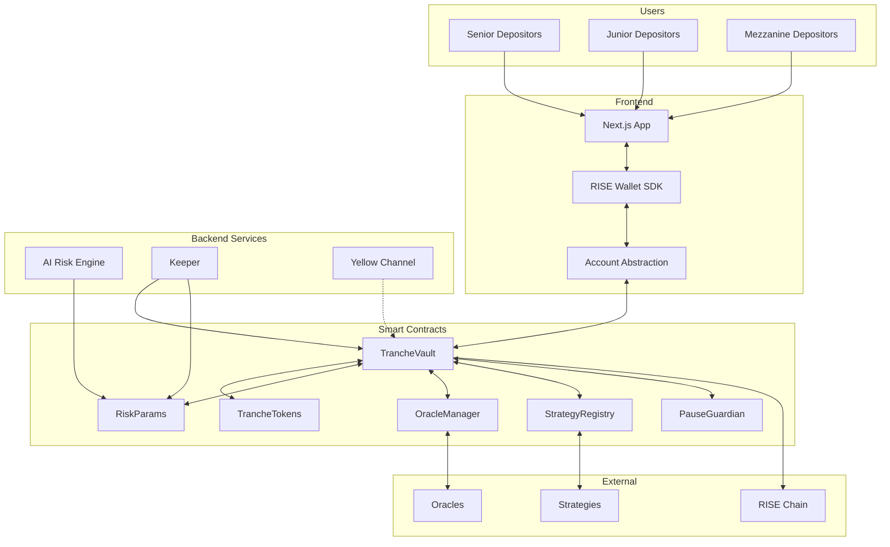

# FluxTranche Architecture

## System Overview

FluxTranche is a modular DeFi protocol implementing risk-tranched yield vaults with AI-driven risk management.



## Contract Architecture

### Core Contracts

#### TrancheVault (ERC-4626)
- **Purpose**: Main vault managing deposits, withdrawals, and epoch settlements
- **Key Functions**:
  - `deposit(uint256 assets, address receiver, uint8 tranche)`
  - `withdraw(uint256 assets, address receiver, address owner, uint8 tranche)`
  - `settleEpoch()` - Calculates and distributes returns via waterfall
  - `previewDeposit/Withdraw()` - ERC-4626 preview functions

#### TrancheToken
- **Purpose**: ERC-20 tokens representing tranche positions
- **Variants**:
  - Senior Token (S-FLUX)
  - Junior Token (J-FLUX)
  - Mezzanine Token (M-FLUX) - Future

#### RiskParams
- **Purpose**: On-chain risk parameter management with AI updates
- **Security**:
  - ECDSA signature verification
  - 24-hour timelock
  - Guardian override capability
- **Key Structs**:
```solidity
struct RiskConfig {
    uint256 epochLength;
    uint256 seniorTargetBps;
    uint256 maxDrawdownBps;
    address[] strategies;
    uint256[] targetWeightsBps;
    uint256[] caps;
}
```

### Waterfall Distribution Logic

```
1. Calculate gross returns: r_gross = r_base + Σ(w_i * r_i) - fees
2. Senior payment: min(SeniorTarget, max(0, r_gross))
3. Remaining to Junior (and Mezzanine if exists)
4. Losses absorbed in reverse order: Junior → Mezzanine → Senior
```

## Backend Services

### AI Risk Engine

**Endpoints**:
- `GET /risk/next` - Next epoch parameters
- `GET /risk/current` - Current parameters
- `POST /risk/sign` - Sign parameters with AI_SIGNER

**Risk Signals** (Mock for MVP):
- Implied volatility
- Funding rates
- Liquidity depth
- Cross-asset correlation
- TWAP deviation

**Output Format**:
```json
{
  "epochLength": 86400,
  "seniorTargetBps": 30,
  "strategies": ["0x..."],
  "targetWeightsBps": [7000, 3000],
  "caps": [1000000],
  "reasons": ["Low vol environment", "Positive funding"],
  "signature": "0x..."
}
```

### Keeper Service

**Responsibilities**:
1. Monitor epoch expiration
2. Call `settleEpoch()` at epoch end
3. Execute queued risk parameters
4. Health checks and alerts

**Cron Schedule**:
```javascript
// Every 5 minutes - check epoch
"*/5 * * * *" - checkEpochStatus()

// Every hour - health check
"0 * * * *" - performHealthCheck()
```

## State Management

### Epoch State Machine

```
ACTIVE → PENDING_SETTLEMENT → SETTLING → SETTLED → ACTIVE
```

- **ACTIVE**: Deposits/withdrawals allowed
- **PENDING_SETTLEMENT**: Epoch ended, awaiting keeper
- **SETTLING**: Settlement in progress
- **SETTLED**: Distribution complete

### Tranche NAV Calculation

```
Senior NAV = Principal + Accrued Coupon
Junior NAV = Principal + Profits - Losses - Senior Payments
Total Assets = Σ(Strategy Balances) + Vault Balance
```

## Security Architecture

### Access Control

```
OWNER (Multisig)
├── GUARDIAN
│   ├── pause()
│   ├── unpause()
│   └── emergencyWithdraw()
├── AI_SIGNER
│   └── signRiskParams()
└── KEEPER
    ├── settleEpoch()
    └── executeParams()
```

### Risk Mitigations

1. **Oracle Manipulation**: Dual-source validation with deviation checks
2. **Reentrancy**: OpenZeppelin ReentrancyGuard on all external calls
3. **Parameter Manipulation**: Timelock + signature verification
4. **Large Withdrawals**: Optional queue mechanism
5. **Emergency**: Pause mechanism preserves withdrawal capability

## Gas Optimization

### RISE Chain Benefits

- **Low fees**: ~0.001 RISE per transaction
- **High throughput**: 100k+ TPS capability
- **Gas sponsorship**: Via account abstraction
- **Batch operations**: Multicall support

### Contract Optimizations

- Storage packing in RiskConfig
- Minimal external calls in hot paths
- Batch updates in settlement
- Event-driven indexing

## Deployment Architecture

### Testnet Deployment

```bash
1. Deploy OracleManager
2. Deploy PauseGuardian
3. Deploy RiskParams(guardian, aiSigner)
4. Deploy StrategyRegistry
5. Deploy TrancheTokens (S, J)
6. Deploy TrancheVault(oracle, params, registry, tokens)
7. Deploy MockStrategy contracts
8. Initialize parameters and whitelist
```

### Upgrade Path

- Contracts are non-upgradeable for security
- New versions deployed alongside
- Migration via withdrawal/redeposit
- Parameter updates via RiskParams

## Integration Points

### Frontend Integration

```typescript
// Wagmi hooks
const { deposit } = useTrancheVault()
const { balance } = useTrancheToken(tranche)
const { epochInfo } = useEpochData()
```

### Strategy Integration

Strategies implement `IStrategyAdapter`:
```solidity
interface IStrategyAdapter {
    function requestFunds(uint256 amount) external;
    function returnFunds(uint256 amount) external;
    function report() external view returns (uint256);
    function simulateEpochReturn() external view returns (int256);
}
```

## Monitoring & Analytics

### Key Metrics

- TVL by tranche
- Epoch returns history
- Strategy performance
- AI parameter accuracy
- Gas usage patterns

### Events

```solidity
event EpochSettled(uint256 indexed epoch, int256 totalReturn);
event TrancheDeposit(address indexed user, uint8 tranche, uint256 amount);
event RiskParamsUpdated(RiskConfig config);
event StrategyReport(address strategy, int256 pnl);
```

## Future Enhancements

### Phase 2 (Post-Hackathon)

- [ ] Real strategy adapters (Aave, Compound, GMX)
- [ ] Advanced AI models with ML pipeline
- [ ] Mezzanine tranche implementation
- [ ] Cross-chain deposits via bridges
- [ ] Governance token and DAO

### Phase 3

- [ ] Options strategies
- [ ] Leveraged tranches
- [ ] Secondary market for tranche tokens
- [ ] Institutional features (KYC, compliance)
- [ ] Insurance fund mechanism